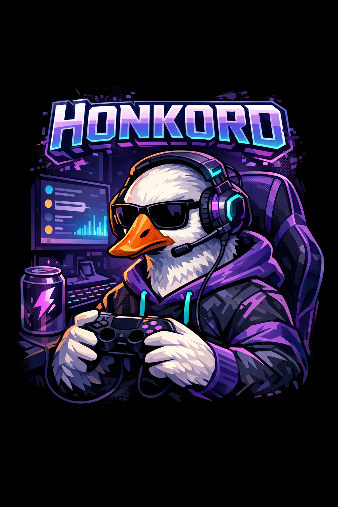
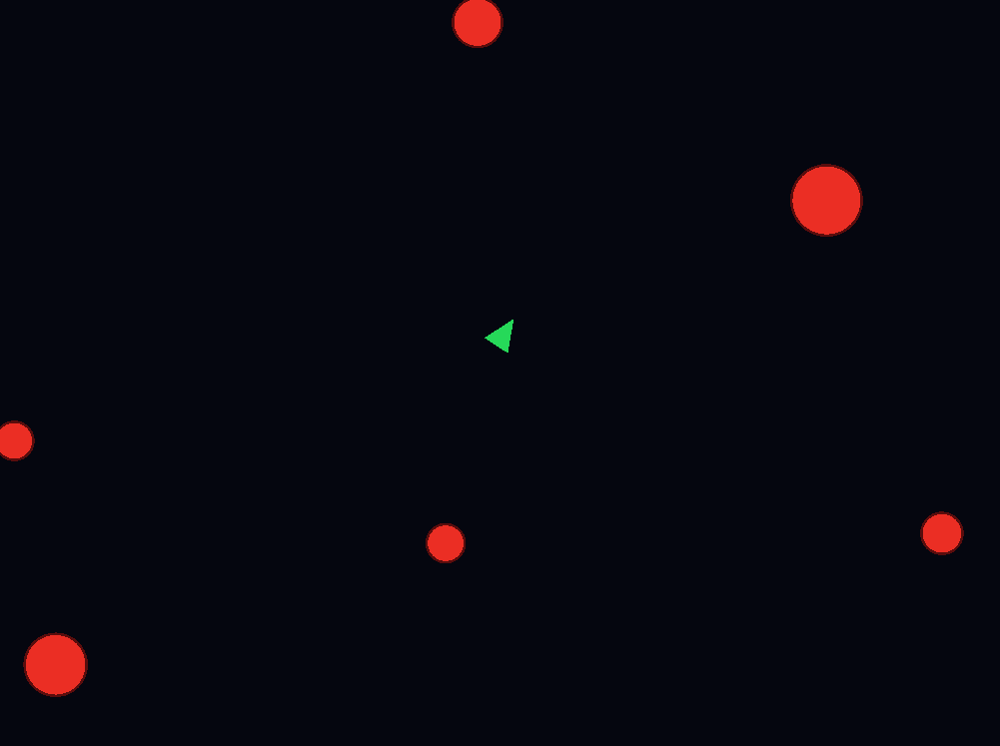
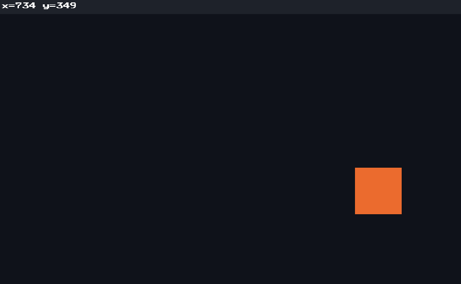
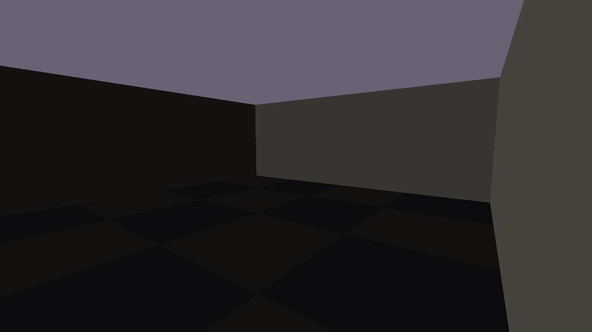
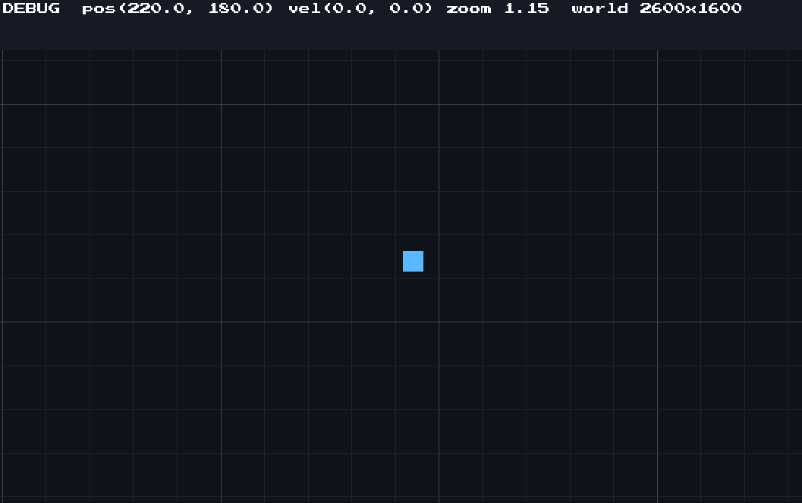
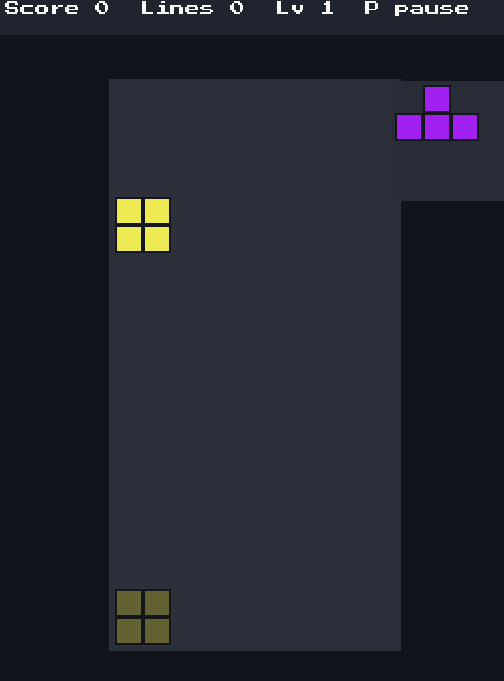
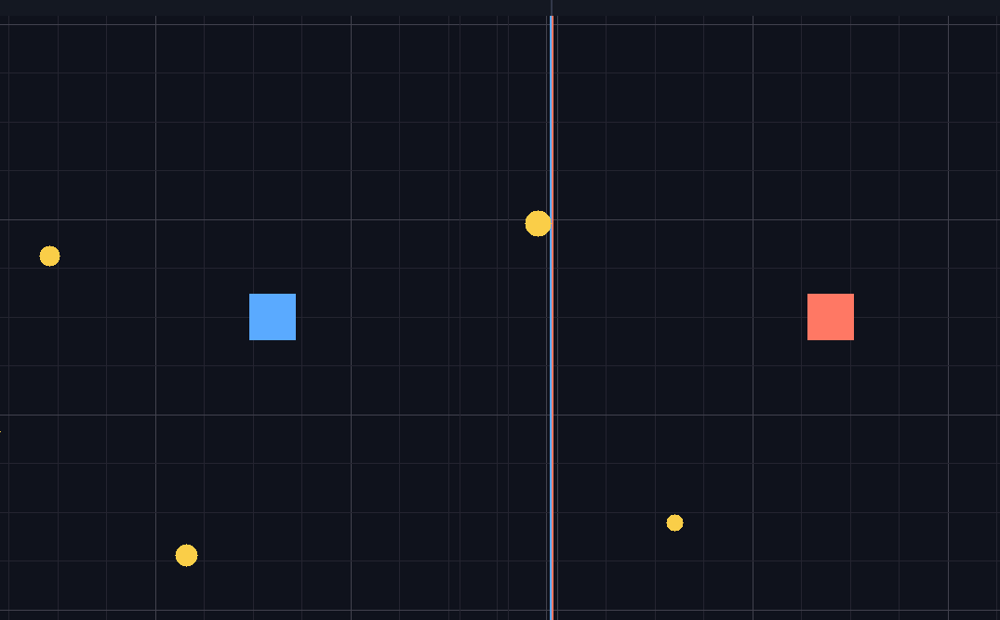

### Project is Unfinished!!!

### Honkord's Game Library (Indie Library) (ISO C++ V.: **C++ 17**)

      

## STATE OF DEVELOPMENT
Version 1 is still in development. At the moment, I am 
looking forward to any minor changes and revisions to 
amend. Stay in touch. :)

## Welcome
Honkord's Game Library is a powerful cross-platform low-level 
multimedia library built for high performance video game 
development. This library is built for interacting 
directly to hardware, therefore rendering performance must be
carefully managed. 

More details are explained inside the docs/ folder, feel free 
to have a look. Any questions, ideas, or concerns, do not 
hesitate to contact me through my gmail 
<samuel.loves.torock@gmail.com> or github 
<https://github.com/Honkord>, I'd very much appreciate. Thank
you. 

## NOTE TO PROGRAMMERS
**ImGui vs Software Renderer**: ImGui HonkordGL rasterizes the 
full UI on the CPU each frame, so it is much slower; it focuses
at correctness and the pure CPU present path, not performance. 

## Honkord's GL API Manual 
# Other Language Bindings (Primarily works with C++)

# Setup

## Need Guidance?
Navigate to docs/tutorial/ directory where I kept SOME guides 
that mostly explains SOME features of the library. 
Have fun on your video game programming!

**NOTE**: We also have a simplified library 
interface written in various languages. 
It is primarily written in C.

## Example Gallery
Out of game ideas? Take a tour through our example
gallery.

# Classic Asteroid Game 

# Deferred Rendering Loop

# Test Debugging & Sprite Movement

# 3D Room Raytracing 

# Single Player World

# Classic Tetris Game

# Two Player Game

